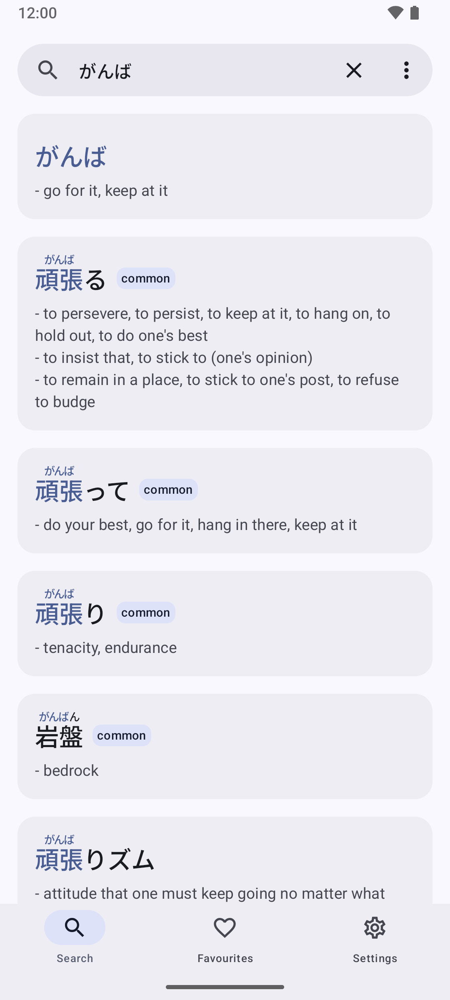
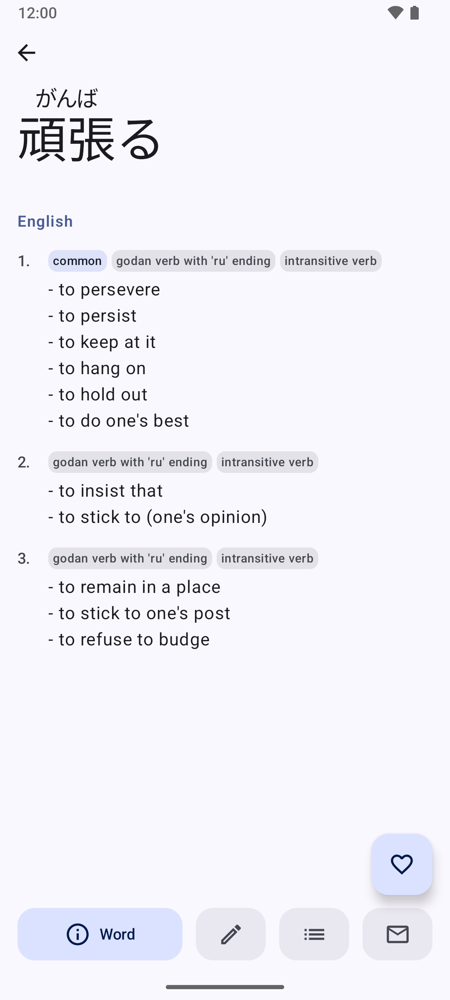
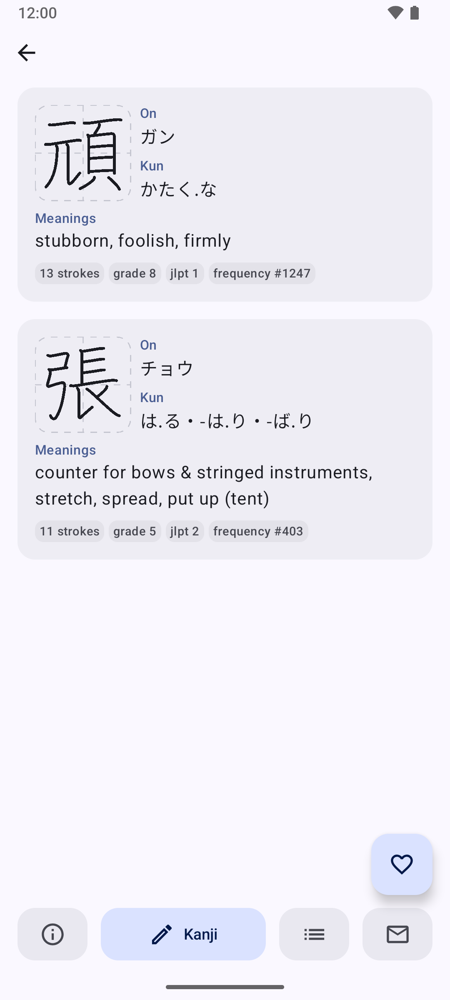
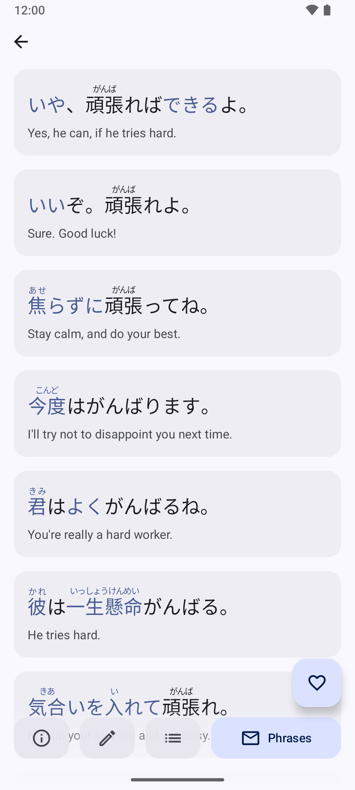
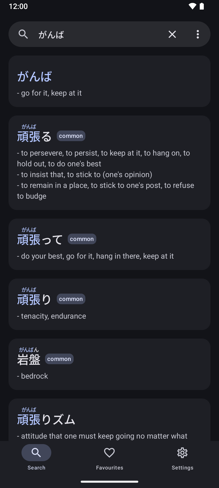
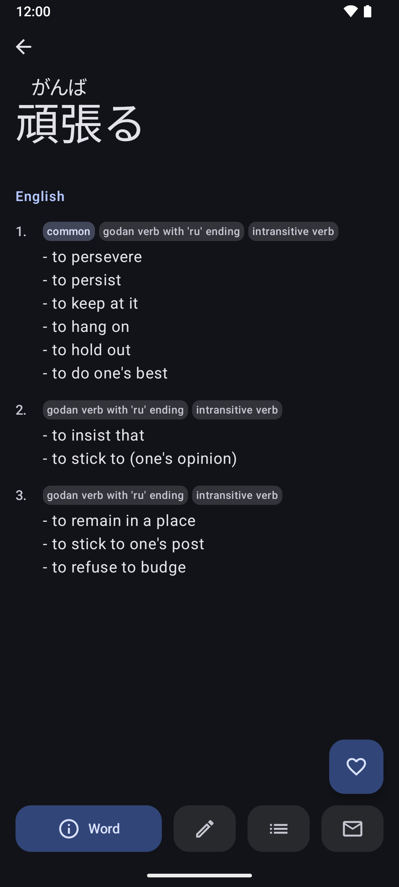
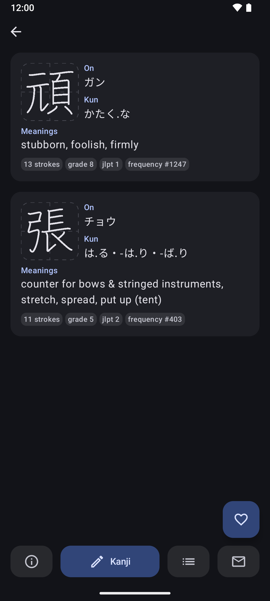
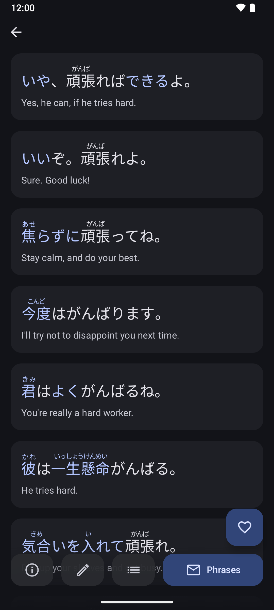

  <h1>Okonomi</h1>
  

  

  Modern Japanese/English dictionary mobile app for language learners. It is built with Kotlin Multiplatform targeting Android and iOS.
  

  

## Screenshots

|                | Search | Word | Kanji | Phrases |
|----------------|--------|------|-------|---------|
| **Light** |  |  |  |  |
| **Dark** |  |  |  |  |

## Building

The apps are built with [fastlane](./fastlane/Fastfile) lanes which uses Gradle underneath. Prepare it once with `mise install && bundle install`, then run one of these with `bundle exec <lane>`. Use `bundle exec <lane>`.

| Lane | Builds |
|---|---|
| `fastlane android build` | the debug APK, and reports where it landed |
| `fastlane android build type:release` | the release APK, and warns when it is debug-signed |
| `fastlane ios build` | the app for the simulator |
| `fastlane ios build type:release` | the app for the simulator, in the Release configuration |

If you don't want to pull in mise/ruby/fastlane into your environment, you can build with Gradle directly:

- Android Debug: `./gradlew :androidApp:assembleDebug`.
- Android Release: `./gradlew :androidApp:assembleRelease`.
- iOS app: open the [/iosApp](./iosApp) directory in Xcode and run it from there.

### Dependencies

- OpenJDK 21
- Android SDK 37 (Android 17)
- [Mise](https://mise.jdx.dev/) - if using fastlane instead of Gradle

### Data sources

The app bundles a SQLite dictionary generated by `:tools:dictgen` from source files in git-ignored `data/`. The first build will automatically download the archives below into `data/archives/` and decompresses them into `data/` before generating.

| Archive in `data/archives/` | Downloaded from | Extracted to | Provides |
|---|---|---|---|
| `JMdict_e.xml.gz` | `https://www.edrdg.org/pub/Nihongo/JMdict_e.gz` | `JMdict_e.xml` | Dictionary entries |
| `JMnedict.xml.gz` | `https://www.edrdg.org/pub/Nihongo/JMnedict.xml.gz` | `JMnedict.xml` | Proper names |
| `kanjidic2.xml.gz` | `https://www.edrdg.org/kanjidic/kanjidic2.xml.gz` | `kanjidic2.xml` | Kanji readings and meanings |
| `radkfile.gz` | `https://www.edrdg.org/pub/Nihongo/radkfile.gz` | `radkfile` | Radical decomposition |
| `jpn_sentences.tsv.bz2` | `https://downloads.tatoeba.org/exports/per_language/jpn/jpn_sentences.tsv.bz2` | `jpn_sentences.tsv` | Japanese example sentences |
| `eng_sentences.tsv.bz2` | `https://downloads.tatoeba.org/exports/per_language/eng/eng_sentences.tsv.bz2` | `eng_sentences.tsv` | Their English translations |
| `jpn_indices.tar.bz2` | `https://downloads.tatoeba.org/exports/jpn_indices.tar.bz2` | `jpn_indices.csv` | Word index linking sentences to entries |
| `kanjivg.zip` | `https://github.com/KanjiVG/kanjivg/releases/download/r20260714/kanjivg-20260714-all.zip` | `kanji/` | Per-stroke outlines for the stroke-order diagrams |

### Tests

The checks are also driven with [fastlane](./fastlane/Fastfile), which groups the Gradle tasks underneath.

| Lane | Runs |
|---|---|
| `fastlane test` | the same set as the PR checks, in one Gradle build |
| `fastlane unit_tests` | the dictionary generator's tests, and the shared tests on the JVM |
| `fastlane migrations` | replays the user database's migrations against the checked-in schema snapshots |
| `fastlane compile` | compiles both targets, `commonTest` for Kotlin/Native included |
| `fastlane lint` | AGP lint over the debug variant |
| `fastlane ios_tests` | the shared tests on an iOS simulator, so macOS only |

## Licenses
- The EDRDG files are used under the [EDRDG licence](https://www.edrdg.org/edrdg/licence.html).
- Tatoeba files under Tatoeba's [terms of use](https://tatoeba.org/en/terms_of_use)
- [KanjiVG](https://kanjivg.tagaini.net/) files are under [CC BY-SA 3.0](https://creativecommons.org/licenses/by-sa/3.0/).

## Mirrors
This repository is hosted on [Forgejo](https://code.hosaka.cc/hosaka/okonomi) which mirrors to the following git forges:
-  - https://codeberg.org/hosaka/okonomi
-  - https://github.com/hosaka/okonomi
